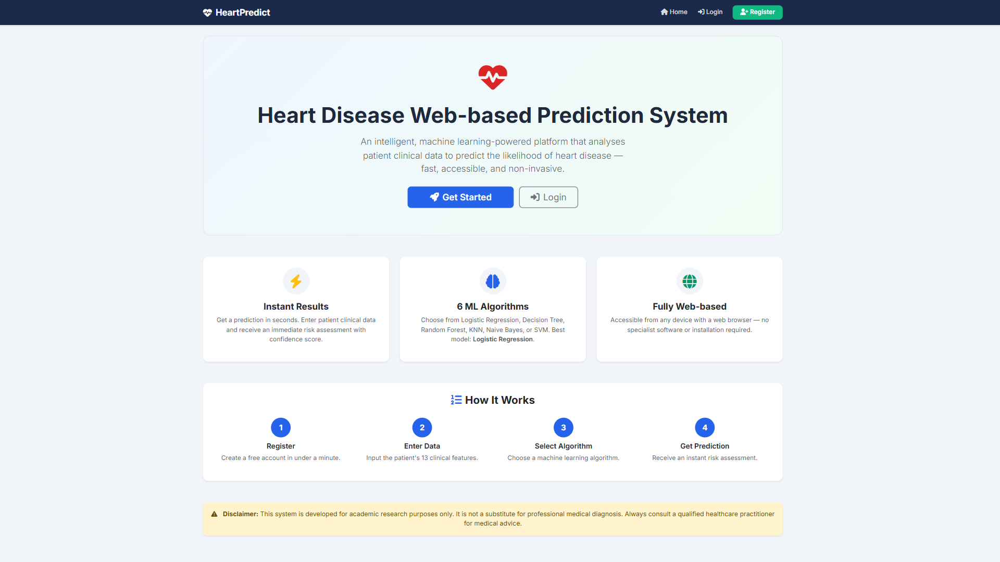
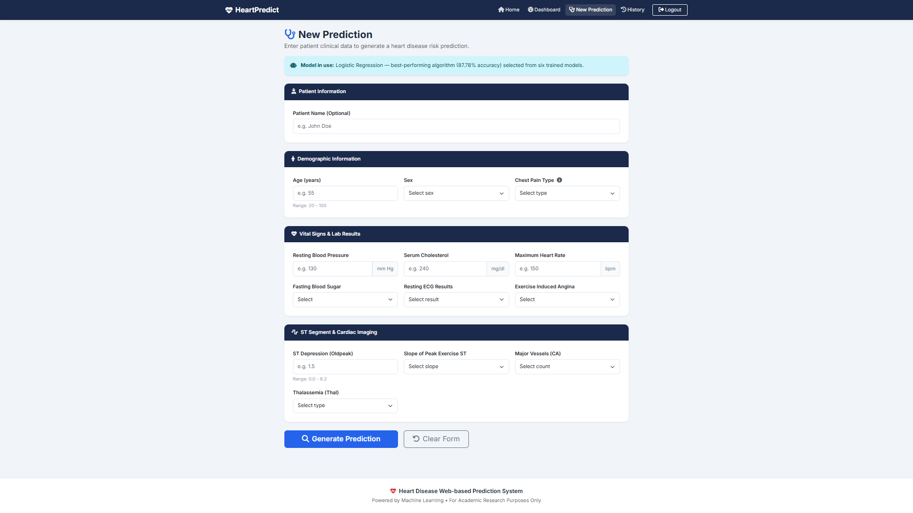
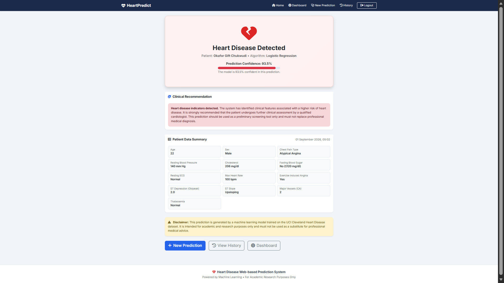
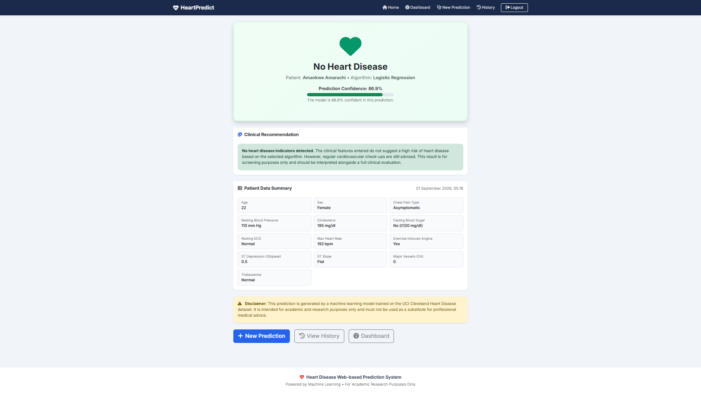
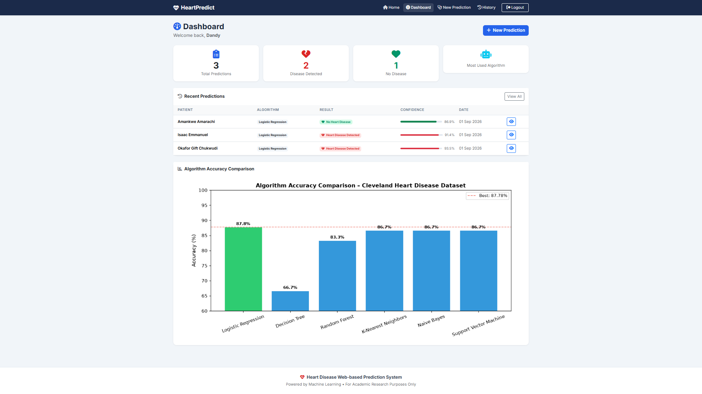
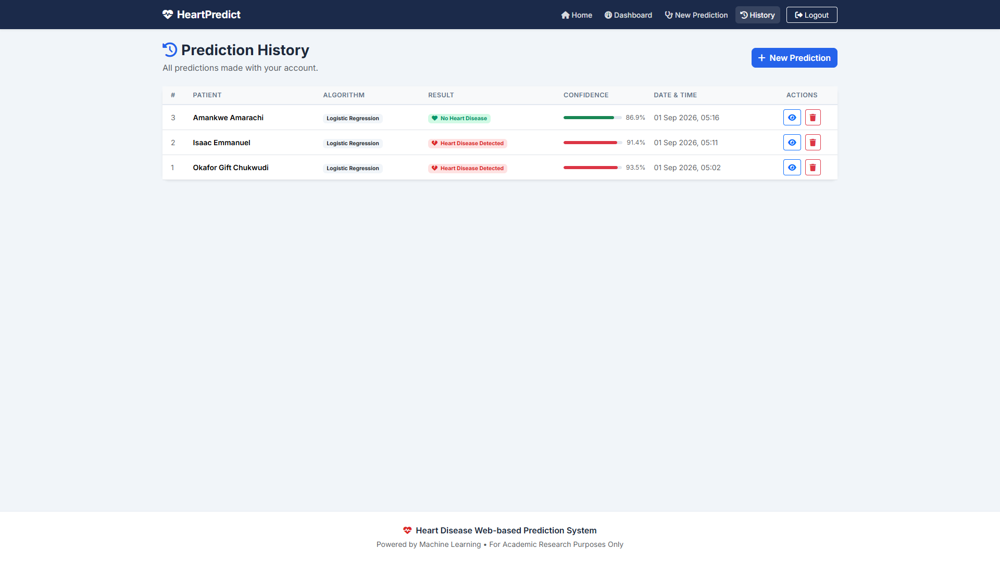
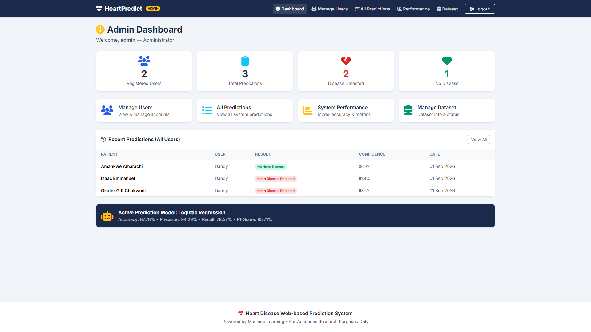
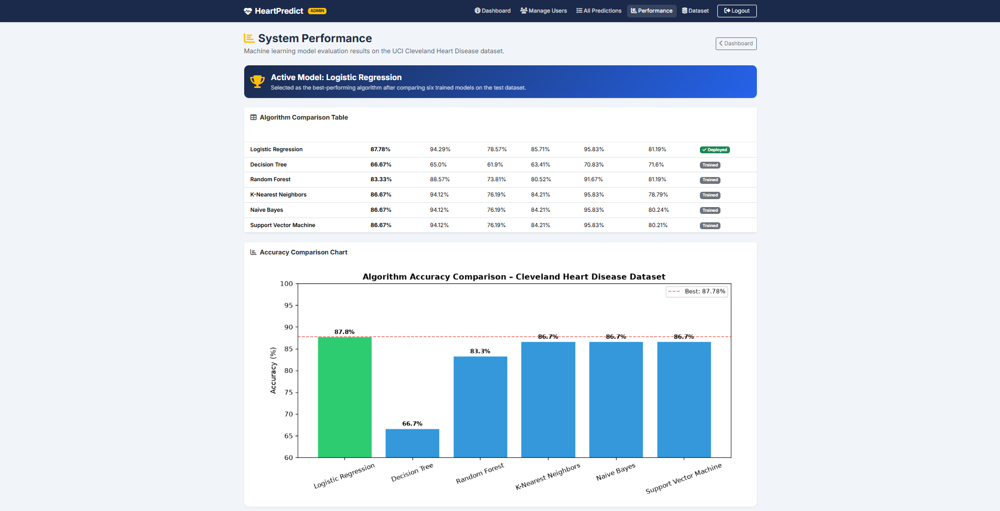

# 🫀Heart Disease Web-based Prediction System

> A machine learning-powered web application that predicts the likelihood 
> of heart disease from patient clinical data — fast, accessible, and non-invasive.


---

## 📋 Table of Contents

- [Project Overview](#-project-overview)
- [Screenshots](#-screenshots)
- [Features](#-features)
- [Machine Learning Results](#-machine-learning-results)
- [Technology Stack](#-technology-stack)
- [System Architecture](#-system-architecture)
- [Installation & Setup](#-installation--setup)
- [Usage](#-usage)
- [Project Structure](#-project-structure)
- [Dataset](#-dataset)
- [Academic Context](#-academic-context)
- [Disclaimer](#-disclaimer)

---

## 📌 Project Overview

The **Heart Disease Web-based Prediction System** is a full-stack web application 
developed as part of my Computer Science Final Year Project. It uses supervised 
machine learning to analyse 13 patient clinical features and predict the 
likelihood of heart disease, delivering results with a confidence score 
through a user-friendly browser interface.

Six machine learning algorithms were trained and compared on the 
**UCI Cleveland Heart Disease Dataset**. The best-performing model — 
**Logistic Regression (87.78% accuracy)** — was deployed into the Flask 
web application as the prediction engine.

The system supports two user roles:
- **User / Patient** — enter clinical data and receive predictions
- **Administrator** — manage users, monitor performance, and manage the dataset

---

## 📸 Screenshots

| Home Page | Prediction Form |
|-----------|----------------|
|  |  |

| Result — Disease Detected | Result — No Disease |
|--------------------------|---------------------|
|  |  |

| User Dashboard | Prediction History |
|---------------|-------------------|
|  |  |

| Admin Dashboard | System Performance |
|----------------|-------------------|
|  |  |

---

## ✨ Features

### User / Patient Side
- 🔐 Secure registration and login with password hashing
- 📋 13-field clinical data input form with tooltips and validation
- 🤖 Instant heart disease risk prediction powered by Logistic Regression
- 📊 Confidence score and clinical recommendation on result page
- 🕐 Persistent prediction history across sessions
- 📈 Algorithm accuracy comparison chart on dashboard

### Administrator Side
- 🛡️ Role-based admin panel (separate from user interface)
- 👥 Manage all registered user accounts
- 📋 View all system-wide predictions from all users
- 📊 Monitor model performance — accuracy table, bar chart, confusion matrices
- 🗄️ Dataset management — view dataset info and status

---

## 🤖 Machine Learning Results

Six supervised learning algorithms were trained on the UCI Cleveland 
Heart Disease Dataset (297 records, 70/30 train-test split):

| Algorithm | Accuracy | Precision | Recall | F1-Score | Specificity |
|-----------|----------|-----------|--------|----------|-------------|
| **Logistic Regression** ✅ | **87.78%** | **94.29%** | **78.57%** | **85.71%** | **95.83%** |
| K-Nearest Neighbors | 86.67% | 94.12% | 76.19% | 84.21% | 95.83% |
| Naive Bayes | 86.67% | 94.12% | 76.19% | 84.21% | 95.83% |
| Support Vector Machine | 86.67% | 94.12% | 76.19% | 84.21% | 95.83% |
| Random Forest | 83.33% | 88.57% | 73.81% | 80.52% | 91.67% |
| Decision Tree | 66.67% | 65.00% | 61.90% | 63.41% | 70.83% |

✅ **Logistic Regression** was selected for deployment based on highest 
overall accuracy, precision, F1-score, and lowest false negative count.

---

## 🛠 Technology Stack

| Layer | Technology |
|-------|-----------|
| Language | Python 3.14.6 |
| Web Framework | Flask 3.1.3 |
| Machine Learning | Scikit-Learn 1.9.0 |
| Database | SQLite (via Flask-SQLAlchemy 3.1.1) |
| Authentication | Flask-Login 0.6.3 + Werkzeug 3.1.8 |
| Frontend | HTML5, CSS3, Bootstrap 5.3, Font Awesome 6 |
| Data Processing | Pandas 3.0.3, NumPy 2.5.1 |
| Visualisation | Matplotlib 3.11.1, Seaborn 0.13.2 |
| IDE | Visual Studio Code |
| OS | Windows 11 |

---

## 🏗 System Architecture

The system follows a **client-server architecture** with two parallel methodologies:
- **OOADM (Object-Oriented Analysis & Design Methodology)** — for the web application
- **CRISP-DM** — for the machine learning pipeline

> Client (Browser)
> │ HTTP Request
> ▼
> Flask Application (app.py)
> │
> ├── Authentication Module
> ├── Prediction Module ──── StandardScaler ──── Logistic Regression Model
> ├── History Module
> ├── Dashboard Module
> └── Admin Modules (Users, Predictions, Performance, Dataset)
> │
> ▼
> SQLite Database
> (users + predictions tables)

---

## ⚙️Installation & Setup

### Prerequisites
- Python 3.10 or higher
- pip

### Step 1 — Clone the repository
```bash
git clone https://github.com/Dandy-ai/heart-disease-prediction-system.git
cd heart-disease-prediction-system
```

### Step 2 — Create and activate a virtual environment
```bash
python -m venv venv

# Windows
venv\Scripts\activate

# macOS/Linux
source venv/bin/activate
```

### Step 3 — Install dependencies
```bash
pip install -r requirements.txt
```

### Step 4 — Download the dataset
Download `heart.csv` from [Kaggle — Heart Disease UCI](https://www.kaggle.com/datasets/ronitf/heart-disease-uci) 
and place it in the `data/` folder.

### Step 5 — Train the models
```bash
python train_models.py
```
This trains all 6 algorithms, saves the best model, and generates performance charts.

### Step 6 — Create the admin account
```bash
python create_admin.py
```
Default credentials: `admin` / `Admin@1234`

### Step 7 — Run the application
```bash
python app.py
```
Open your browser at: **http://127.0.0.1:5000**

---

## 🚀 Usage

### As a Regular User
1. Click **Register** to create an account
2. Log in with your credentials
3. Click **New Prediction** and enter the patient's 13 clinical values
4. The system uses Logistic Regression to generate an instant result
5. View the confidence score, clinical recommendation, and patient data summary
6. Access your full prediction history from the **History** page

### As Administrator
1. Log in with `admin` / `Admin@1234`
2. Access **Manage Users** to view and manage all accounts
3. Access **All Predictions** to monitor system-wide activity
4. Access **Performance** to view model accuracy metrics and charts
5. Access **Dataset** to check dataset status and information

---

## 📁 Project Structure

> heart-disease-prediction-system/
> │
> ├── app.py # Main Flask application
> ├── train_models.py # ML training and evaluation script
> ├── create_admin.py # Admin account creation utility
> ├── requirements.txt # Python dependencies
> │
> ├── static/
> │ ├── css/style.css # Custom stylesheet
> │ └── img/ # Generated charts (after training)
> │
> ├── templates/
> │ ├── base.html # Master template with role-aware navbar
> │ ├── home.html # Landing page
> │ ├── login.html # User login
> │ ├── register.html # User registration
> │ ├── dashboard.html # User dashboard
> │ ├── predict.html # Prediction form
> │ ├── result.html # Prediction result
> │ ├── history.html # Prediction history
> │ └── admin/
> │ ├── dashboard.html # Admin dashboard
> │ ├── users.html # User management
> │ ├── predictions.html # All predictions view
> │ ├── performance.html # Model performance
> │ └── dataset.html # Dataset management
> │
> ├── data/ # Place heart.csv here (committed)
> ├── models/ # Saved models (generated after training)
> ├── instance/ # SQLite database (generated at runtime)
> └── screenshots/ # System screenshots for README

---

## 📊 Dataset

**UCI Cleveland Heart Disease Dataset**
- **Source:** [UCI Machine Learning Repository](https://archive.ics.uci.edu/dataset/45/heart+disease)
- **Kaggle mirror:** [Heart Disease UCI](https://www.kaggle.com/datasets/ronitf/heart-disease-uci)
- **Records:** 297 (after removing missing values)
- **Features:** 13 clinical predictor variables
- **Target:** Binary (0 = No Disease, 1 = Disease Present)
- **Class distribution:** No Disease: 160 (53.9%) | Disease: 137 (46.1%)
- **Split:** 70% training (207 records) / 30% test (90 records)

---

## 🎓 Academic Context

This project was developed as a **Computer Science Final Year Project** at
Nnamdi Azikiwe University, Awka, Anambra State, Nigeria.
The research involved a systematic comparison of six 
machine learning algorithms for heart disease prediction, and the deployment 
of the best-performing model into a fully functional web-based clinical 
decision support system.

**Methodologies used:**
- OOADM (Object-Oriented Analysis and Design Methodology)
- CRISP-DM (Cross-Industry Standard Process for Data Mining)

---

## ⚠️ Disclaimer

This system is developed **strictly for academic research purposes only**. 
It is not a medical device and must not be used as a substitute for 
professional medical diagnosis. Always consult a qualified healthcare 
practitioner for medical advice.

---

*Developed by Dandy — Computer Science Graduate*
